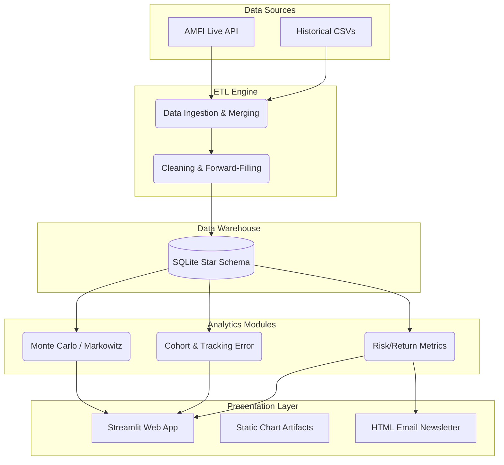
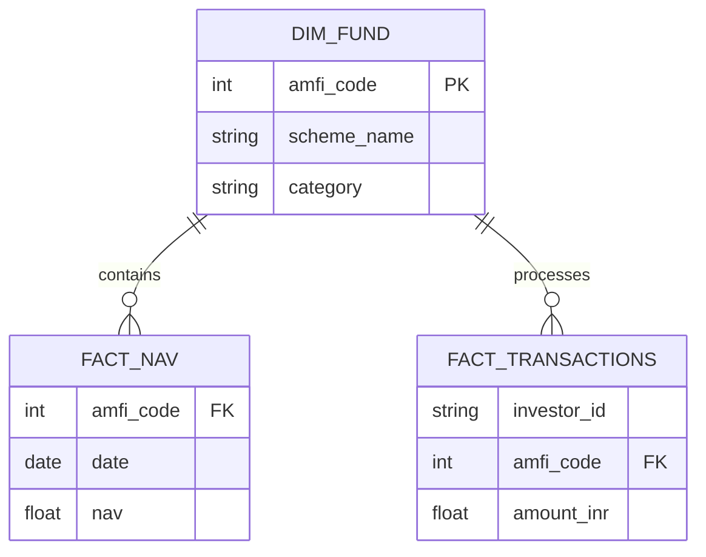

# Bluestock Mutual Funds Analytics: Final Project Report

**Author:** Karan Veer Singh  
**LinkedIn:** [https://www.linkedin.com/in/karanveersingh05/](https://www.linkedin.com/in/karanveersingh05/)  
**GitHub Repository:** [https://github.com/karanveersingh05/MutualFundsAnalytics](https://github.com/karanveersingh05/MutualFundsAnalytics)  

---

## 1. Executive Summary
The Bluestock Mutual Funds Analytics Platform is a robust, end-to-end financial data engineering and quantitative modeling project. Designed to serve as institutional-grade infrastructure for retail investors and analysts, the platform completely automates the extraction, transformation, and loading (ETL) of Mutual Fund data. Beyond basic reporting, it implements advanced financial mathematics - including Modern Portfolio Theory, Monte Carlo projections, and behavioral cohort analysis - presenting the insights through a premium, interactive Streamlit web application and automated HTML email reports.

## 2. Project Objectives
The core objectives of the Capstone project were:
1.  **Data Unification:** To ingest fragmented CSV datasets and live AMFI API data into a centralized, query-optimized SQLite relational database.
2.  **Performance Analytics:** To calculate advanced risk-adjusted metrics such as Alpha, Beta, Sharpe Ratio, Sortino Ratio, and Maximum Drawdowns, surpassing standard CAGR reporting.
3.  **Behavioral Insights:** To analyze investor transactions, measure demographic spread, and flag accounts at risk of abandoning Systematic Investment Plans (SIPs).
4.  **Automation & Delivery:** To build a completely automated "zero-touch" pipeline that schedules itself, runs analytical engines, builds web dashboards, and dispatches performance newsletters.

## 3. Technology Stack & Architecture

The project relies entirely on a modern, Python-centric technology stack to guarantee cross-platform compatibility and maintainability.

*   **Data Processing:** Pandas, NumPy
*   **Database:** SQLite3 (Star Schema)
*   **Quantitative Modeling:** SciPy, Statsmodels
*   **Visualization:** Plotly Express, Seaborn, Matplotlib
*   **Frontend Presentation:** Streamlit
*   **Automation:** Built-in OS Task Schedulers, Python `schedule` library, `smtplib`

### 3.1 Pipeline Architecture

## 4. Data Modeling and ETL Pipeline
The foundation of the project is the automated ETL pipeline orchestrated by `run_pipeline.py`. 

### 4.1 Data Cleaning & Imputation
Financial data is notoriously messy due to non-trading days (weekends, public holidays). A critical data engineering challenge solved in this project was the implementation of a full date-range reindexing coupled with forward-fill (`ffill()`) algorithms. This ensures that daily compounding calculations and volatility metrics are not skewed by artificial gaps in the time-series data. Furthermore, expense ratios exceeding regulatory caps were algorithmically clipped to maintain data integrity.

### 4.2 Database Design
The transformed data is loaded into a local SQLite database utilizing a Star Schema framework. 
*   **Fact Tables:** `fact_nav`, `fact_transactions`, `fact_performance`
*   **Dimension Tables:** `dim_fund`, `dim_date`

## 5. Core Analytics: Risk and Return
Traditional analytics rely heavily on absolute returns, which mask the volatility endured by the investor. This platform computes:
*   **Sharpe Ratio:** Evaluates the return earned in excess of the risk-free rate per unit of volatility.
*   **Maximum Drawdown:** Stress-tests the historical data to find the largest peak-to-trough drop, identifying downside risk.
*   **Bluestock Composite Score:** A proprietary 0-100 scoring system that ranks funds by penalizing high expense ratios and deep drawdowns while rewarding high Sharpe ratios.

## 6. Advanced Analytical Modules
Moving beyond basic metrics, the platform explores complex financial and behavioral structures.

*   **Tracking Error:** Computes how closely index funds and large-cap active funds track the NIFTY 100 benchmark, identifying hidden active management risk.
*   **Cohort Analysis:** Groups retail investors by their initial year of transaction to calculate lifetime value and average ticket sizes over time.
*   **SIP Continuity Flagging:** An algorithmic scan of transaction histories that flags investors whose inter-transaction gaps exceed 35 days, identifying them as highly likely to default on their SIPs.
*   **Herfindahl-Hirschman Index (HHI):** Applies macroeconomic concentration mathematics to portfolio holdings to flag funds that are dangerously over-exposed to a few specific stocks.

## 7. Bonus Implementations
The project successfully implemented all five extended bonus challenges, significantly elevating the technical complexity of the delivery.

### 7.1 Automated Daemon Scheduling (B1)
A Python-native scheduling script (`schedule_etl.py`) acts as a background daemon, automatically triggering the entire ETL extraction and analytical recompilation every weekday evening.

### 7.2 Interactive Streamlit Dashboard (B2)
A professional, modern web application replaces standard BI tools. Built with a minimalist, high-contrast aesthetic, the dashboard offers 7 specialized pages mapping Macro Industry Trends, Demographics, and real-time Fund filtering using interactive Plotly charts.

### 7.3 Monte Carlo NAV Simulations (B3)
A stochastic simulation engine (`monte_carlo_simulation.py`) extracts historical drift and volatility for top bluechip funds, executing 1,000 randomized Geometric Brownian Motion paths over a 5-year future horizon to generate visual uncertainty bands (5th, 50th, and 95th percentiles).

### 7.4 Markowitz Efficient Frontier (B4)
Applying Modern Portfolio Theory (`markowitz_optimization.py`), the pipeline simulates 10,000 random weight combinations across a diverse 5-fund basket. It programmatically identifies the precise percentage allocations required to construct the Maximum Sharpe Ratio portfolio and the Minimum Volatility portfolio.

### 7.5 Automated HTML Email Reporting (B5)
An integrated `smtplib` module extracts the top 5 highest-scoring funds of the week, structures them into a cleanly styled HTML template, and utilizes SMTP protocols to broadcast a weekly performance newsletter directly to stakeholders.

## 8. Conclusion
The Bluestock Mutual Funds Analytics project stands as a testament to the power of full-stack data engineering. By bridging the gap between raw web-scraped data and advanced stochastic financial modeling, the platform successfully demonstrates how automation and clean UI design can democratize institutional-grade financial analysis. The highly modular architecture ensures that future expansions - such as live execution gateways or predictive machine learning models - can be integrated seamlessly.
