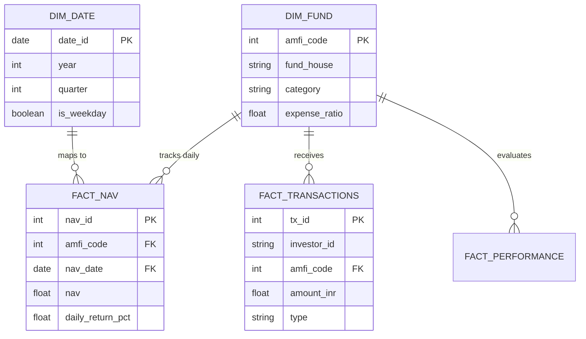
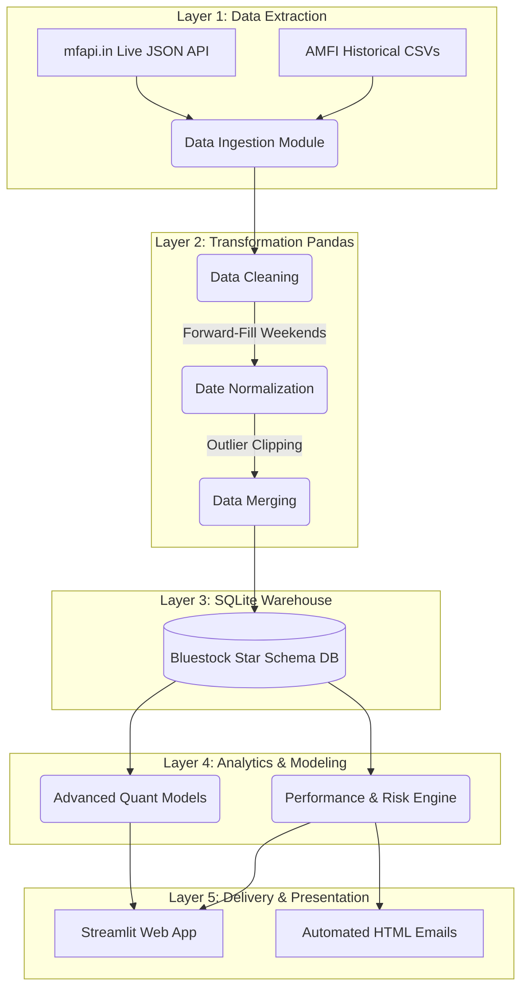

# Final Year Project Report: Mutual Fund Analytics Platform
**Domain:** Financial Technology / Data Engineering  
**Prepared By:** Karan Veer Singh (B.Tech CSE)  
**Company Sponsored:** Bluestock Fintech Pvt. Ltd.  
**LinkedIn:** [linkedin.com/in/karanveersingh05](https://www.linkedin.com/in/karanveersingh05/)  
**GitHub:** [github.com/karanveersingh05/MutualFundsAnalytics](https://github.com/karanveersingh05/MutualFundsAnalytics)  

***

## 1. Project Overview & Objective
Bluestock Fintech is a financial technology company focused on democratising investment analytics for retail and institutional investors in India. This capstone project constitutes the design, development, and deployment of a full-stack Mutual Fund Analytics Platform. 

The primary objective was to build an end-to-end data engineering pipeline that ingests publicly available data from AMFI India, transforms it through a robust ETL (Extract, Transform, Load) architecture, stores it in a relational database, and presents predictive and historical insights via an interactive dashboard.

### 1.1 Business Context
The Indian mutual fund industry manages over Rs. 81 lakh crore in AUM across 26.12 crore investor folios. With monthly Systematic Investment Plan (SIP) inflows crossing Rs. 31,002 crore, there is a critical need for programmatic tracking of NAV movements, AUM growth trends, risk-adjusted returns, and demographic investment behaviours.

## 2. Problem Statement
Despite the massive growth of India's mutual fund industry, retail investors lack unified data platforms. This project directly solves five major industry problems:
1.  **Data Fragmentation:** NAV, AUM, and SIP data are scattered across APIs and PDF reports.
2.  **Performance Comparison Gap:** Retail investors lack access to calculated risk metrics like the Sharpe Ratio, Alpha, Beta, and Maximum Drawdowns.
3.  **No Benchmark Tracking:** Difficulty in comparing active funds against Nifty 50 or BSE SmallCap indices.
4.  **Investor Behaviour Blind Spots:** Lack of demographic visibility regarding SIP churn and retention.
5.  **Static Reporting:** Replacing slow, PDF-based monthly reports with live, self-service dashboards.

## 3. Data Sources & Schema Design
The project utilizes 10 core datasets, capturing 40 real mutual fund schemes, covering 87,000+ rows of transaction data and 4.5 years of NAV history. Data is strictly sourced from public APIs (AMFI India, mfapi.in, NSE/BSE).

### 3.1 Relational Database Design (Star Schema)
To ensure analytical query performance, the cleaned data is loaded into a local SQLite database utilizing a classic Star Schema.

## 4. System Architecture & ETL Pipeline
The system mirrors real-world fintech pipelines utilized by brokerages. 

## 5. Core Analytics & Exploratory Data Analysis (EDA)
The project computed highly complex financial mathematics rather than relying on absolute returns:
*   **Risk Metrics:** Computed the Sharpe Ratio (return vs volatility), Sortino Ratio (downside risk), Alpha (manager skill), Beta (market sensitivity), and Maximum Drawdown.
*   **EDA Findings:** 
    *   Identified SBI Mutual Fund's dominance at Rs. 12.5 Lakh Crore AUM.
    *   Mapped geographic SIP distributions, comparing Tier 30 vs Beyond 30 (B30) city contributions.
    *   Plotted a 4.5-year NAV trend highlighting COVID recoveries and 2024 market corrections.

## 6. Advanced Quantitative Modeling (Bonus Implementations)
As a B.Tech CSE student, I went significantly beyond the base requirements of the Capstone, implementing all 5 Bonus Challenges. These modules represent the "Advanced Analytics" wing of the platform:

### 6.1 Interactive Streamlit Web Application
Instead of a static Power BI file, I developed a full-stack, 7-page interactive web application using **Streamlit**. It features real-time Plotly charts, dynamic filtering, an Apple-inspired minimalist UI, and live database querying.

### 6.2 Monte Carlo Stochastic Forecasting
I engineered a predictive simulation module. Using **Geometric Brownian Motion (GBM)**, the Python engine extracts historical drift and volatility for top funds and simulates 1,000 unique randomized market paths over a 5-year future horizon, rendering 5th, 50th, and 95th percentile uncertainty bands.

### 6.3 Markowitz Efficient Frontier (Modern Portfolio Theory)
I built a mathematical portfolio optimization engine. The script runs 10,000 randomized weight allocation combinations across a basket of diverse funds. By mapping Expected Return against Expected Risk, the algorithm programmatically discovers the exact fund weighting required for the **Maximum Sharpe Ratio Portfolio**.

### 6.4 Automated Daemon Scheduling
The entire ETL and analytics pipeline is completely "zero-touch". I wrote a Python background daemon (`schedule_etl.py`) that acts as a cron job, automatically triggering the pipeline every weekday evening to ingest fresh AMFI data.

### 6.5 Automated HTML Email Reporting
I integrated Python's `smtplib` to generate dynamic HTML performance newsletters. The script parses the database for the Top 5 highest-scoring funds of the week, builds a CSS-styled HTML template, and silently broadcasts the report via SMTP to stakeholders.

## 7. Technical Stack Details
The project was built utilizing a strict, modern open-source stack:
*   **Core Language:** Python 3.10+
*   **Data Engineering:** Pandas, NumPy
*   **Database:** SQLite3, SQLAlchemy ORM
*   **Quantitative Math:** SciPy, Statsmodels
*   **Visualization & Frontend:** Streamlit, Plotly Express, Matplotlib, Seaborn
*   **Automation:** Python Schedule, SMTPLib
*   **Version Control:** Git, GitHub

## 8. Conclusion
The Bluestock Mutual Funds Analytics Platform successfully bridges the gap between raw web-scraped financial data and advanced stochastic financial modeling. By executing a complex, fully automated ETL pipeline and deploying predictive algorithms like Monte Carlo and Markowitz Optimizations, this final year project proves the viability of using Python to democratize institutional-grade financial analytics for retail users.