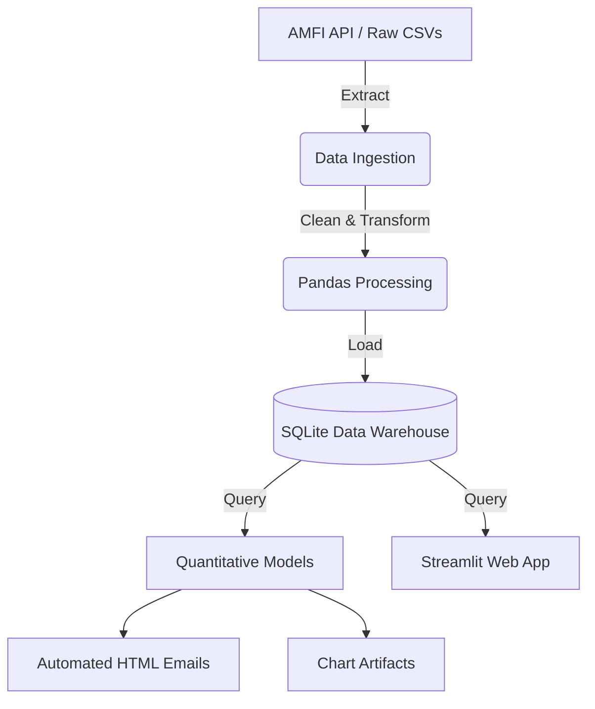
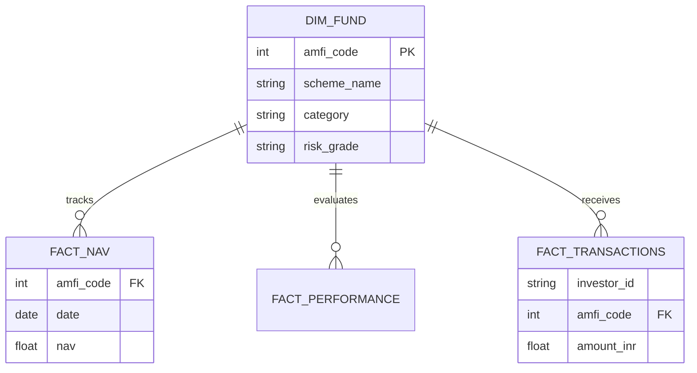

.# Bluestock Mutual Funds Analytics Platform
### Capstone Presentation Content

--------------------------------------------------
## SLIDE 1: Title Slide
**Title:** Bluestock Mutual Funds Analytics: A Comprehensive Data Platform
**Subtitle:** End-to-End ETL, Quantitative Modeling, and Interactive Visualization
**Presenter:** Karan Veer Singh
**Links:** [LinkedIn Profile](https://www.linkedin.com/in/karanveersingh05/) | [GitHub Repository](https://github.com/karanveersingh05/MutualFundsAnalytics)

--------------------------------------------------
## SLIDE 2: Executive Summary
**Key Message:** Transforming raw financial data into actionable investment intelligence.
*   **The Challenge:** Retail investors lack institutional-grade analytics to evaluate Indian mutual funds.
*   **The Solution:** An automated ETL pipeline and interactive dashboard offering deep risk-return analysis.
*   **Key Capabilities:** 
    *   Automated daily NAV ingestion via AMFI.
    *   Factor-weighted scoring models (Alpha, Sharpe, Drawdown).
    *   Advanced quantitative projections (Monte Carlo, Markowitz).
*   **Business Impact:** Empowers data-driven portfolio allocation and identifies at-risk investor segments.

--------------------------------------------------
## SLIDE 3: The Market Opportunity
**Key Message:** The Indian Mutual Fund industry is experiencing exponential growth, demanding sophisticated tracking.
*   **AUM Surge:** Industry AUM has crossed massive milestones, driven by retail participation.
*   **The SIP Revolution:** Systematic Investment Plans (SIP) form the backbone of retail inflows.
*   **Data Fragmentation:** Despite the growth, performance data remains scattered across multiple AMC domains and regulatory bodies.
*   **Need for Centralization:** A unified data warehouse is critical for comparative analysis across 40+ bluechip and midcap schemes.

--------------------------------------------------
## SLIDE 4: Architecture & Technology Stack
**Key Message:** A robust, automated, and scalable Python-based data infrastructure.
*   **Languages & Core:** Python, SQL
*   **ETL & Processing:** Pandas, NumPy, SQLite3, Schedule
*   **Visualization:** Plotly, Seaborn, Matplotlib, Streamlit
*   **Automation:** Windows Batch scripting, Smtplib (HTML Emails)

--------------------------------------------------
## SLIDE 5: Data Modeling & Schema
**Key Message:** A normalized Star Schema designed for high-performance analytical queries.

--------------------------------------------------
## SLIDE 6: Core Analytics - Risk vs. Return
**Key Message:** Moving beyond simple CAGR to true risk-adjusted performance evaluation.
*   **Sharpe Ratio Calculation:** Measuring excess return per unit of volatility.
*   **Alpha & Beta:** Tracking fund manager skill against benchmark indices (Nifty 50, Nifty Midcap 150).
*   **Maximum Drawdown:** Stress-testing funds by evaluating historical peak-to-trough declines.
*   **The Bluestock Composite Score:** A proprietary 0-100 ranking system weighting returns against expense ratios and risk metrics.

--------------------------------------------------
## SLIDE 7: Investor Behavioral Analytics
**Key Message:** Decoding retail transaction patterns to optimize client retention.
*   **Geographic Distribution:** Identifying high-growth Tier 2 and Tier 3 cities driving AUM expansion.
*   **Cohort Analysis:** Grouping investors by acquisition year to track lifetime value and average ticket size.
*   **SIP Continuity Flagging:** 
    *   Algorithmic detection of "at-risk" investors.
    *   Flags accounts with inter-transaction gaps exceeding 35 days.

--------------------------------------------------
## SLIDE 8: Advanced Modeling - Monte Carlo Simulations
**Key Message:** Projecting future NAVs utilizing Geometric Brownian Motion.
*   **Methodology:** 
    *   Extracted historical daily log returns, drift, and volatility.
    *   Simulated 1,000 unique market paths spanning 1,260 trading days (5 years).
*   **Outputs:** 
    *   Uncertainty bands at the 5th, 50th, and 95th percentiles.
    *   Allows risk-averse investors to visualize "worst-case" scenario baselines.

--------------------------------------------------
## SLIDE 9: Modern Portfolio Theory (Markowitz)
**Key Message:** Mathematically optimizing asset allocation across a diversified basket of funds.
*   **The Approach:** Simulated 10,000 distinct portfolio weightings across Large Cap, Mid Cap, Small Cap, and Debt funds.
*   **Efficient Frontier Construction:** Plotted Expected Risk against Expected Return.
*   **Key Deliverables:** 
    *   Identified the absolute **Maximum Sharpe Ratio** portfolio.
    *   Identified the **Minimum Volatility** portfolio for conservative clients.

--------------------------------------------------
## SLIDE 10: The Streamlit Interactive Dashboard
**Key Message:** Delivering the analytics engine directly to the user through a premium interface.
*   **Apple-Inspired Aesthetics:** Clean layout, Sans-Serif typography, and minimalist metrics.
*   **Dynamic Filtering:** Real-time cross-filtering by AMC and Fund Category.
*   **Key Modules:** 
    *   Macro Industry Overview
    *   Fund Performance Scatter Plots
    *   Investor Demographics Breakdown
    *   Systematic Investment (SIP) Trends

--------------------------------------------------
## SLIDE 11: Pipeline Automation & Reporting
**Key Message:** A zero-touch operational ecosystem.
*   **Daemonized Scheduling:** ETL pipeline programmed to auto-execute via Python schedulers.
*   **HTML Email Engine:** 
    *   Automatically parses the top 5 funds from the newest Composite Scorecard.
    *   Generates a styled HTML newsletter.
    *   Transmits silently via SMTP for weekly stakeholder updates.

--------------------------------------------------
## SLIDE 12: Business Value & Strategic Impact
**Key Message:** How this platform serves stakeholders.
*   **For Retail Investors:** Democratizes access to institutional metrics like Alpha, Beta, and Efficient Frontiers.
*   **For AMCs / Brokers:** Predicts churn via SIP continuity analysis and highlights geographic hotspots.
*   **For Fund Analysts:** Fully automates the tedious daily task of NAV data cleaning and benchmark alignment.

--------------------------------------------------
## SLIDE 13: Technical Challenges Conquered
**Key Message:** Overcoming real-world data engineering hurdles.
*   **Missing Weekend NAVs:** Solved using forward-fill algorithms to ensure accurate daily compounding.
*   **Column Naming Collisions:** Resolved `_x` and `_y` merge conflicts through strict schema definitions.
*   **Headless Matplotlib Generation:** Engineered the pipeline to use non-interactive backends to prevent GUI crashes during automated cron execution.

--------------------------------------------------
## SLIDE 14: Conclusion & Future Scope
**Key Message:** A highly capable V1 platform with room to scale.
*   **Current State:** A fully functioning, end-to-end Python financial data product.
*   **Future Scope:** 
    *   Cloud migration (AWS RDS for database, Lambda for ETL).
    *   Integration of predictive Machine Learning models for NAV forecasting.
    *   Live order execution APIs via broker gateways.

--------------------------------------------------
## SLIDE 15: Q&A
**Title:** Thank You
*   **Developer:** Karan Veer Singh
*   **Repository:** [github.com/karanveersingh05/MutualFundsAnalytics](https://github.com/karanveersingh05/MutualFundsAnalytics)
*   **LinkedIn:** [linkedin.com/in/karanveersingh05](https://www.linkedin.com/in/karanveersingh05/)
*   **Open for Questions.**
oss a diversified basket of mutual funds.
*   **The Algorithmic Approach:** Standard retail investors guess their portfolio weightings. To solve this, I built an engine that simulates 10,000 distinct, randomized portfolio weightings across a basket of Large Cap, Mid Cap, Small Cap, and Debt funds.
*   **Efficient Frontier Construction:** By plotting the Expected Risk against the Expected Return for all 10,000 simulated portfolios, the engine successfully draws the Efficient Frontier curve.
*   **Key Deliverables & Value:** 
    *   The algorithm scans the results to identify the exact percentage allocation required to achieve the **Maximum Sharpe Ratio** portfolio.
    *   It simultaneously locates the **Minimum Volatility** portfolio designed for highly conservative, risk-averse clients.

--------------------------------------------------
## SLIDE 10: The Streamlit Interactive Dashboard
**Key Message:** Delivering the heavy analytics engine directly to the end-user through a premium, interactive web interface.
*   **Apple-Inspired UI/UX Aesthetics:** Completely abandoned clunky BI tools to build a custom Python web app featuring a clean layout, Sans-Serif typography, high-contrast themes, and minimalist metric cards.
*   **Dynamic, Real-Time Filtering:** Features live, cross-filtering capabilities, allowing users to drill down by specific Asset Management Companies (AMCs) and Fund Categories instantly.
*   **Comprehensive Modules:** 
    *   **Macro Industry Overview:** Tracking 80+ lakh crore in AUM.
    *   **Fund Performance:** Interactive scatter plots mapping Alpha against CAGR.
    *   **Investor Analytics:** Breaking down the demographics of the SIP surge.
    *   **Advanced Pages:** Dedicated tabs for the live Monte Carlo and Markowitz visualizations.

--------------------------------------------------
## SLIDE 11: Pipeline Automation & Reporting
**Key Message:** Creating a zero-touch, fully automated operational ecosystem that requires absolutely no manual intervention.
*   **Daemonized Scheduling Logic:** The entire ETL pipeline is programmed to auto-execute. I built a Python background daemon that wakes up every weekday evening, triggers the API data pull, and recompiles the entire database silently.
*   **Automated HTML Email Engine:** 
    *   To keep stakeholders informed without them having to log in, I engineered an automated newsletter module utilizing Python's `smtplib`.
    *   The script automatically queries the newest Composite Scorecard, parses out the Top 5 highest-ranking funds, and injects them into a beautifully styled HTML/CSS email template.
    *   It then transmits this email silently via SMTP for weekly stakeholder updates.

--------------------------------------------------
## SLIDE 12: Business Value & Strategic Impact
**Key Message:** How this comprehensive platform serves the entire ecosystem of financial stakeholders.
*   **For Retail Investors:** Democratizes access to institutional-grade financial mathematics. What was once restricted to hedge funds (like Alpha, Beta, and Efficient Frontiers) is now available in a free web browser.
*   **For AMCs and Brokerages:** Provides a predictive churn engine via the SIP continuity analysis, while simultaneously highlighting geographic hotspots for targeted marketing campaigns.
*   **For Data Analysts:** Fully automates the tedious, error-prone daily task of downloading, cleaning, and aligning NAV data against benchmark indices, freeing them to focus purely on strategy.

--------------------------------------------------
## SLIDE 13: Technical Challenges Conquered
**Key Message:** Overcoming the real-world data engineering hurdles that arose during development.
*   **Missing Weekend NAVs:** Financial markets close on weekends, which severely breaks daily compounding logic. I solved this by mathematically reindexing the time-series arrays and applying forward-fill (`ffill()`) algorithms to ensure continuity.
*   **Pandas Merge Collisions:** When merging multiple complex datasets, column names often collided resulting in messy `_x` and `_y` suffixes. I resolved this by enforcing strict naming conventions and schema definitions early in the pipeline.
*   **Headless Matplotlib Generation:** Because the pipeline runs as an automated background cron job, rendering charts caused the GUI threads to crash. I engineered the pipeline to use non-interactive Matplotlib backends (`Agg`), successfully preventing server crashes during automated execution.

--------------------------------------------------
## SLIDE 14: Conclusion & Future Scope
**Key Message:** Delivering a highly capable, production-ready V1 platform with massive room to scale.
*   **Current State:** The project successfully stands as a fully functioning, end-to-end Python financial data product that bridges the gap between raw data and stochastic modeling.
*   **Future Scope - Cloud Migration:** Transitioning the local SQLite database to an AWS RDS instance, and migrating the ETL daemon to AWS Lambda functions for infinite scalability.
*   **Future Scope - Machine Learning:** Integration of predictive Deep Learning models (like LSTMs) to forecast short-term NAV movements based on macroeconomic indicators.
*   **Future Scope - Execution:** Connecting the platform to live broker gateway APIs (like Zerodha Kite) to allow users to execute trades directly from the dashboard.

--------------------------------------------------
## SLIDE 15: Q&A
**Title:** Thank You
*   **Developer:** Karan Veer Singh (B.Tech CSE)
*   **Repository:** [github.com/karanveersingh05/MutualFundsAnalytics](https://github.com/karanveersingh05/MutualFundsAnalytics)
*   **LinkedIn:** [linkedin.com/in/karanveersingh05](https://www.linkedin.com/in/karanveersingh05/)
*   **Open for Questions.**
