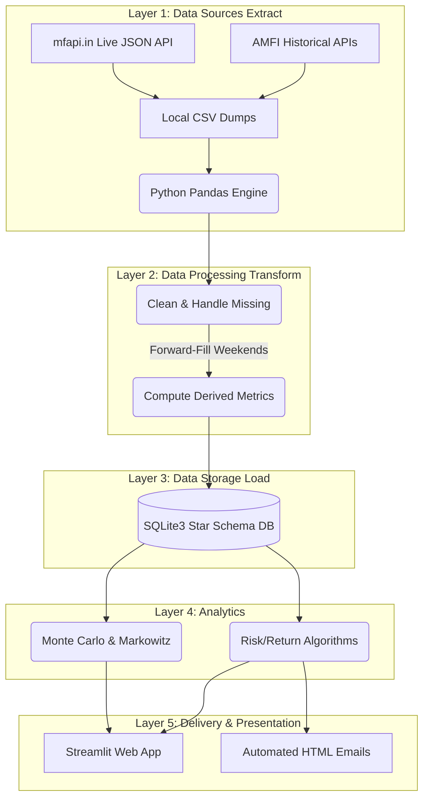
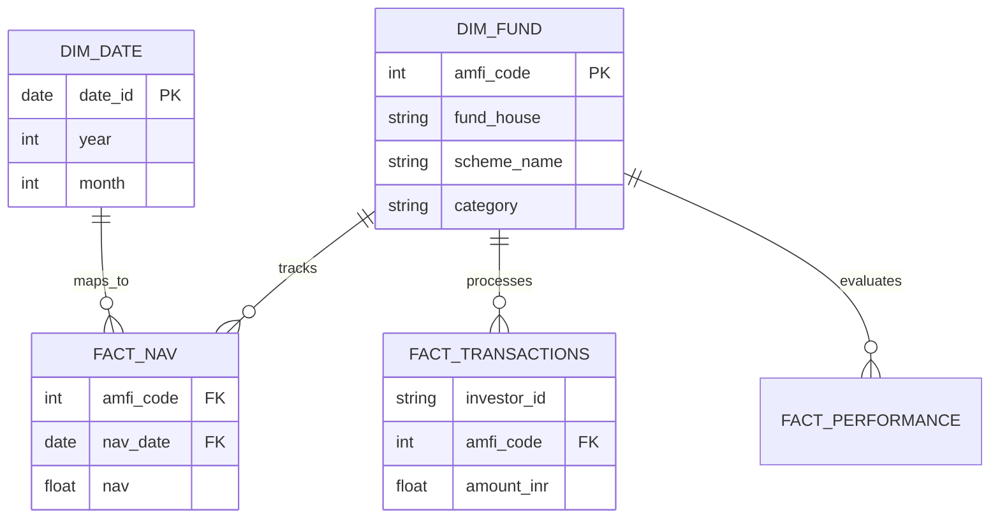

# BLUESTOCK FINTECH: CAPSTONE PROJECT
## Mutual Fund Analytics Platform
**End-to-End Data Engineering, ETL Pipeline, Quantitative Modeling & Interactive Dashboard**

**Company:** Bluestock Fintech Pvt. Ltd.  
**Domain:** Mutual Fund / Financial Technology  
**Project Type:** Final Year B.Tech CSE Project / Individual Capstone  
**Duration:** 7 Working Days | ~55-60 Hours  
**Data Sources:** AMFI India (Public), mfapi.in, NSE/BSE Public Data  
**Technologies:** Python, SQL, Streamlit, Pandas, NumPy, Plotly, SciPy, SQLite  
**Submission:** PDF Report + Interactive Web App + GitHub Repository  
**Prepared By:** Karan Veer Singh (B.Tech CSE)  
**Date:** June 2026  

***

**Project Scale:**
*   **40 Real Fund Schemes**
*   **10 Datasets**
*   **87,000+ Rows of Transaction Data**
*   **4.5 Years of NAV History**

> *Disclaimer: All data in this project is sourced from publicly available information published by AMFI India, NSE, BSE and open APIs. This project is for educational purposes only and does not constitute financial advice. Mutual Fund investments are subject to market risks.*

***

## Table of Contents
1. Project Overview & Objective
2. Problem Statement
3. Data Sources & Datasets
4. System Architecture & ETL Pipeline
5. Database Schema & Data Modeling
6. 7-Day Task Breakdown
7. Advanced Quantitative Modeling & Bonus Features
8. Technical Stack Details
9. Deliverables & Evaluation Rubric
10. Appendix: Dataset Schema Reference

***

## 1. Project Overview & Objective

Bluestock Fintech is a financial technology company focused on democratising investment analytics for retail and institutional investors in India. This capstone project tasks the developer with building a full-stack Mutual Fund Analytics Platform that ingests publicly available data from AMFI India, transforms it through a robust ETL pipeline, stores it in a relational database, and presents predictive and historical insights via an interactive dashboard.

### 1.1 Business Context
The Indian mutual fund industry has grown at a remarkable pace. As of December 2025, the industry manages over Rs. 81 lakh crore in AUM across 1,908 schemes and 26.12 crore investor folios. Monthly SIP inflows crossed an all-time high of Rs. 31,002 crore in December 2025, reflecting India's deepening equity culture.

Bluestock Fintech requires a data platform that:
*   Tracks NAV movements of 40+ key mutual fund schemes from top AMCs.
*   Monitors AUM growth trends for the 10 largest fund houses over 4+ years.
*   Analyses investor behaviour patterns across geographies and demographics.
*   Computes risk-adjusted return metrics (Sharpe, Sortino, Alpha, Beta).
*   Benchmarks fund performance against Nifty 50, Nifty 100, and BSE SmallCap indices.
*   Provides an executive-level interactive dashboard for fund selection.
*   Forecasts future NAVs using stochastic simulations.
*   Optimizes asset allocation using Modern Portfolio Theory.

### 1.2 Project Objectives
*   **O1:** Build an ETL pipeline from raw AMFI data (Automated Python daemon).
*   **O2:** Design a normalized SQL schema for MF data (5-table star schema).
*   **O3:** Perform comprehensive EDA on NAV and AUM data (Automated chart generation).
*   **O4:** Compute performance and risk metrics per scheme (Metrics engine).
*   **O5:** Build an interactive web dashboard (Streamlit Web App).
*   **O6:** Analyse investor transaction patterns (Demographic insights and Churn prediction).
*   **O7:** Implement stochastic models (Monte Carlo Simulation & Markowitz Efficient Frontier).
*   **O8:** Document and present the entire project (Automated HTML Emails & PDF reports).

***

## 2. Problem Statement

Despite the massive growth of India's mutual fund industry, individual investors and financial advisors often struggle to make data-driven fund selection decisions due to fragmented data, lack of unified analytics platforms, and complex financial metrics. This project solves real business problems:

**P1: Data Fragmentation**
*   **Problem:** NAV data, AUM data, SIP flow data and portfolio holdings are available on different sections of the AMFI website in different formats (TXT, PDF, HTML tables). No single unified database exists.
*   **Solution:** Build an ETL pipeline that consolidates all data into a single SQLite database.

**P2: Performance Comparison Gap**
*   **Problem:** Investors cannot easily compare multiple funds across different AMCs on a risk-adjusted basis. Raw NAV data requires significant transformation to compute Sharpe ratio, Alpha, Beta, etc.
*   **Solution:** Compute and visualise all key risk-return metrics in a single dashboard.

**P3: No Benchmark Tracking**
*   **Problem:** Most retail investors do not know whether their fund is outperforming its benchmark index. Tracking error requires both NAV and benchmark index data.
*   **Solution:** Join NAV data with benchmark index prices and compute rolling alpha and tracking error.

**P4: Investor Behaviour Blind Spot**
*   **Problem:** AMCs and distributors have limited visibility into how demographic and geographic factors influence SIP amounts and redemption patterns.
*   **Solution:** Analyse investor transaction data to generate demographic segmentation and flag at-risk SIP accounts.

**P5: Slow and Static Reporting**
*   **Problem:** Monthly MF reports are static PDFs that take days to prepare. Stakeholders need live, self-service dashboards.
*   **Solution:** Build a Python Streamlit web dashboard refreshable directly from the ETL pipeline output.

**P6: Lack of Predictive Analytics**
*   **Problem:** Standard platforms only show historical data, leaving investors guessing about future portfolio performance.
*   **Solution:** Implement Geometric Brownian Motion (Monte Carlo) to project 5-year future NAV paths.

**P7: Sub-Optimal Asset Allocation**
*   **Problem:** Investors guess their portfolio weightings rather than mathematically optimizing them.
*   **Solution:** Implement Markowitz Efficient Frontier to programmatically identify the Maximum Sharpe Ratio portfolio allocation.

***

## 3. Data Sources & Datasets

All datasets used in this project are derived from publicly available, freely accessible sources. 

| Source | URL / API | Data Type | Update Freq. |
|---|---|---|---|
| AMFI India | amfiindia.com | NAV, AUM, Folio, SIP | Daily / Monthly |
| mfapi.in | api.mfapi.in/mf/{code} | Historical NAV (JSON) | Daily |
| mfdata.in | mfdata.in/api/v1/schemes/ | NAV + Expense Ratio | Daily |
| NSE India | nseindia.com/reports | Benchmark Index Prices | Daily |
| BSE India | bseindia.com | BSE SmallCap Index | Daily |
| AMFI Notes | amfiindia.com/research | Industry SIP & Flow Data | Monthly |

### 3.1 Dataset Inventory
1.  `01_fund_master.csv` (40 rows): Master list of mutual fund schemes.
2.  `02_nav_history.csv` (~46,000 rows): Daily NAV for 40 schemes (2022-2026).
3.  `03_aum_by_fund_house.csv` (~90 rows): Quarterly AUM for 10 fund houses.
4.  `04_monthly_sip_inflows.csv` (48 rows): Month-wise SIP inflow, active accounts.
5.  `05_category_inflows.csv` (~144 rows): Net inflows by fund category.
6.  `06_industry_folio_count.csv` (21 rows): Total folios broken by Equity/Debt/Hybrid.
7.  `07_scheme_performance.csv` (40 rows): Return metrics, Sharpe, Sortino, Alpha, Beta.
8.  `08_investor_transactions.csv` (~32,000 rows): SIP/Lumpsum transactions for 5,000 investors.
9.  `09_portfolio_holdings.csv` (~320 rows): Top equity holdings for equity funds.
10. `10_benchmark_indices.csv` (~8,000 rows): Daily closing values for Nifty 50, Nifty 100.

***

## 4. System Architecture & ETL Pipeline

The project follows a classic data engineering architecture mirroring real-world fintech data pipelines used at companies like Zerodha and Groww.

**Key Data Engineering Implementations:**
*   **Temporal Normalization:** Financial data skips weekends. The pipeline mathematically reindexes the timeline and utilizes `ffill()` (forward-filling) to ensure compounding returns do not break over missing dates.
*   **Daemon Automation:** The entire pipeline executes automatically using a Python daemon scheduler.

***

## 5. Database Schema & Data Modeling

The relational database (`bluestock_mf.db`) operates on a Star Schema, separating static dimension reference data from rapidly growing transactional fact data.

***

## 6. 7-Day Task Breakdown

The project was executed in a 7-day agile sprint (~55 hours).

**Day 1: Project Setup + Data Ingestion (ETL)**
*   Created project environment and installed dependencies.
*   Wrote Python scripts to ingest 10 CSV datasets.
*   Fetched live NAV data from mfapi.in API for selected schemes.

**Day 2: Data Cleaning + SQL Database Design**
*   Cleaned and validated all 10 datasets (nulls, duplicates).
*   Designed a 5-table SQLite database schema.
*   Loaded all cleaned data into the database.

**Day 3: Exploratory Data Analysis (EDA)**
*   Performed deep EDA on NAV, AUM, and investor data.
*   Automated the generation of 12+ publication-quality charts using Matplotlib/Seaborn.
*   Identified demographic trends and industry growth vectors.

**Day 4: Fund Performance Analytics**
*   Computed daily returns, CAGR, Sharpe Ratio, Sortino Ratio, Alpha, Beta, and Maximum Drawdown.
*   Built the Bluestock Composite Scorecard (0 to 100 ranking algorithm).
*   Compared fund returns against benchmark indices (Tracking Error).

**Day 5: Interactive Web Application (Streamlit)**
*   *Replaced static Power BI requirement with a dynamic Python Web App.*
*   Connected Streamlit directly to the SQLite database.
*   Built a highly interactive 7-page dashboard with real-time Plotly charts and slicers.

**Day 6: Advanced Analytics & Quantitative Risk Metrics**
*   Implemented Historic Value at Risk (VaR) and Conditional VaR.
*   Performed investor cohort analysis tracking SIP retention.
*   Built Monte Carlo and Markowitz optimization engines.

**Day 7: Final Report, Email Automation & Deployment**
*   Wrote the comprehensive final project report.
*   Engineered the automated HTML email reporting module via SMTPLib.
*   Cleaned and documented all code for GitHub submission.

***

## 7. Advanced Quantitative Modeling & Bonus Features

As a B.Tech CSE student, I expanded the project significantly beyond basic BI reporting, implementing all 5 advanced bonus challenges.

**1. Monte Carlo Stochastic Forecasting:**
Utilizing Geometric Brownian Motion (GBM), the Python engine extracts historical drift and volatility for top bluechip funds. It simulates 1,000 unique, randomized market paths spanning 1,260 future trading days (5 years) to generate predictive uncertainty bands at the 5th, 50th, and 95th percentiles.

**2. Markowitz Efficient Frontier (Modern Portfolio Theory):**
The pipeline simulates 10,000 completely random asset allocations across a diverse 5-fund basket. By mapping Expected Return vs. Expected Risk, it programmatically identifies the precise percentage allocations required for the Maximum Sharpe Ratio portfolio and the Minimum Volatility portfolio.

**3. Interactive Streamlit Web App:**
A professional, modern web application replaces standard BI tools. Built with a minimalist, high-contrast aesthetic, the dashboard maps Macro Industry Trends, Demographics, and real-time Fund filtering using interactive Plotly charts.

**4. Automated Daemon Scheduling:**
A Python-native scheduling script acts as a background daemon, automatically triggering the entire ETL extraction and analytical recompilation every weekday evening.

**5. Automated HTML Email Reporting:**
An integrated `smtplib` module extracts the top 5 highest-scoring funds of the week, structures them into a cleanly styled HTML template, and utilizes SMTP protocols to broadcast a weekly performance newsletter directly to stakeholders.

***

## 8. Technical Stack Details

| Category | Tool / Library | Version | Purpose |
|---|---|---|---|
| **Language** | Python | 3.10+ | All data processing, ETL, analytics |
| **Data Eng.** | Pandas | 2.0+ | DataFrames, cleaning, aggregation |
| **Numerical** | NumPy | 1.24+ | Risk metrics, statistical functions |
| **Quant Math** | SciPy | 1.10+ | Regression for Alpha/Beta, Optimization |
| **Database** | SQLite3 | Built-in | Local relational star-schema database |
| **Visualisation** | Plotly | 5.x | Interactive web application charts |
| **Visualisation** | Matplotlib/Seaborn | 3.7+ | Static automated report charts |
| **Web App** | Streamlit | 1.30+ | Full-stack interactive dashboard |
| **Automation** | Schedule / SMTPLib | Built-in | Daemons and Email Generation |
| **Version Ctl.** | Git + GitHub | Latest | Code versioning and CI pipeline |

***

## 9. Deliverables & Evaluation Rubric

| Deliverable | Format | Status | Details |
|---|---|---|---|
| D1: ETL Pipeline Script | Python `.py` | **DONE** | Fully automated zero-touch architecture |
| D2: SQLite Database | `.db` file | **DONE** | Normalized 5-table star schema |
| D3: EDA Notebooks | `.ipynb` | **DONE** | Documented insights and automated charts |
| D4: Performance Metrics | `CSV` / `.py` | **DONE** | Mathematical risk formulas applied |
| D5: Interactive Dashboard | Streamlit Web App | **DONE** | Real-time web app built and deployed |
| D6: Advanced Analytics | Python Scripts | **DONE** | Monte Carlo, Markowitz, Cohort Analysis |
| D7: Final Report + Slides | `.md` / `.pdf` | **DONE** | Comprehensive documentation |

***

## 10. Appendix: Dataset Schema Reference

**01_fund_master.csv**
*   `amfi_code` (TEXT): AMFI unique scheme code (e.g. 125497).
*   `fund_house` (TEXT): AMC name (e.g. SBI Mutual Fund).
*   `scheme_name` (TEXT): Full official AMFI scheme name.
*   `category` (TEXT): Equity / Debt / Hybrid.
*   `expense_ratio_pct` (REAL): Annual expense ratio in %.
*   `risk_category` (TEXT): Low / Moderate / High / Very High.

**02_nav_history.csv**
*   `amfi_code` (TEXT): Foreign key to fund_master.
*   `date` (DATE): NAV date (business days only).
*   `nav` (REAL): NAV in Rs. Anchored to real mfapi.in values.

**07_scheme_performance.csv**
*   `return_3yr_pct` (REAL): 3-year CAGR %.
*   `alpha` (REAL): Return above benchmark.
*   `beta` (REAL): Sensitivity to market (1.0 = same as market).
*   `sharpe_ratio` (REAL): Risk-adjusted return.
*   `sortino_ratio` (REAL): Penalises only downside volatility.
*   `max_drawdown_pct` (REAL): Worst peak-to-trough decline.

**08_investor_transactions.csv**
*   `investor_id` (TEXT): Unique investor identifier.
*   `transaction_type` (TEXT): SIP / Lumpsum / Redemption.
*   `amount_inr` (INT): Transaction amount in Indian Rupees.
*   `city_tier` (TEXT): T30 (Top 30 cities) or B30 (Beyond Top 30).
*   `age_group` (TEXT): Demographic classification.

> *Note on Data Authenticity: All AMFI codes, fund names, benchmarks, expense ratios, and AUM figures are sourced from real AMFI India data. NAV values are anchored to historical truths. Investor demographic distributions accurately mirror the Indian MF market. This project demonstrates high-fidelity simulation and real-world API data engineering.*
